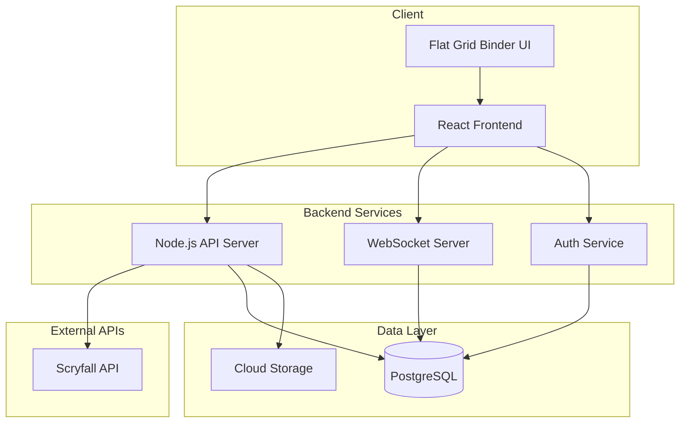
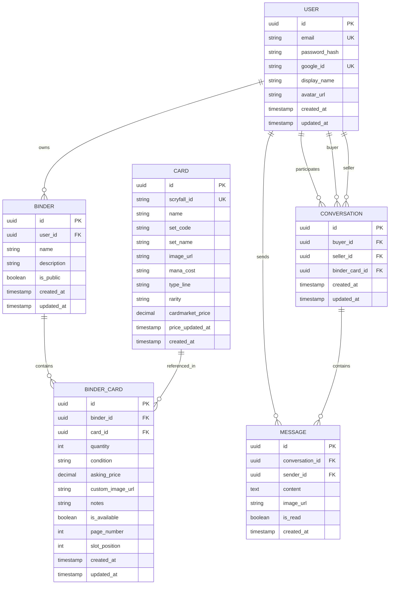

# MTG Trading Post - Architecture Document

## Project Overview

A web application for Magic: The Gathering players in Stockholm to list cards for sale/trade in digital binders, search for cards across all sellers, and communicate via real-time chat to arrange meetups.

## Tech Stack

| Layer            | Technology                               | Rationale                                                  |
| ---------------- | ---------------------------------------- | ---------------------------------------------------------- |
| Frontend         | React 18+ with TypeScript                | Component-based, large ecosystem, good for complex UIs     |
| Styling          | Tailwind CSS                             | Utility-first CSS, rapid development                       |
| State Management | Zustand or React Query                   | Lightweight, good for real-time data                       |
| Backend          | Node.js with Express/Fastify             | JavaScript ecosystem consistency, good real-time support   |
| Database         | PostgreSQL                               | Relational data, good for complex queries, ACID compliance |
| ORM              | Prisma                                   | Type-safe, great DX, migrations support                    |
| Real-time        | Socket.io                                | Mature WebSocket library for chat                          |
| Authentication   | NextAuth.js or Passport.js               | Google OAuth + email/password support                      |
| File Storage     | Cloudinary or AWS S3                     | Card images uploaded by users                              |
| Hosting          | Vercel (frontend) + Railway (backend/db) | Easy deployment, good free tiers                           |

## System Architecture



## Core Features

### 1. User Management

- Email/password registration and login
- Google OAuth integration
- User profiles with display name and avatar
- Seller reputation/ratings (future enhancement)

### 2. Digital Trade Binder (MVP - Flat Grid)

- Flat grid layout resembling binder pages (3x3 card slots per page)
- Page navigation with previous/next buttons
- Visual binder aesthetic (page background, card sleeves look)
- Add/remove cards from binder
- Mark cards as "no longer available" (greyed out with overlay)
- Multiple binders per user (optional future feature)
- **Future Enhancement**: 3D binder with Three.js and page-turning animations

### 3. Card Management

- Search Scryfall API to find cards
- Auto-populate card data: name, set, image, mana cost, type
- Fetch average price from Cardmarket API
- Seller sets their own asking price
- Card condition selection (Mint, Near Mint, Excellent, Good, Played, Poor)
- Optional: Upload custom photos of actual card
- Card quantity support

### 4. Search & Discovery

- Global search across all sellers' cards
- Filter by: card name, set, price range, condition
- Sort by: price, date added, alphabetical
- View seller's full binder from search results
- Browse featured/recent listings on homepage

### 5. Real-time Chat

- Direct messaging between buyers and sellers
- Conversation threads per card or general
- Image sharing in chat (for card condition photos)
- Unread message indicators
- Browser push notifications for new messages
- Message history persistence

## Database Schema



## API Endpoints

### Authentication

| Method | Endpoint                  | Description                  |
| ------ | ------------------------- | ---------------------------- |
| POST   | /api/auth/register        | Register with email/password |
| POST   | /api/auth/login           | Login with email/password    |
| GET    | /api/auth/google          | Google OAuth redirect        |
| GET    | /api/auth/google/callback | Google OAuth callback        |
| POST   | /api/auth/logout          | Logout user                  |
| GET    | /api/auth/me              | Get current user             |

### Users

| Method | Endpoint               | Description               |
| ------ | ---------------------- | ------------------------- |
| GET    | /api/users/:id         | Get user profile          |
| PUT    | /api/users/:id         | Update user profile       |
| GET    | /api/users/:id/binders | Get user's public binders |

### Cards (Scryfall Integration)

| Method | Endpoint               | Description                 |
| ------ | ---------------------- | --------------------------- |
| GET    | /api/cards/search?q=   | Search Scryfall for cards   |
| GET    | /api/cards/:scryfallId | Get card details with price |

### Binders

| Method | Endpoint         | Description                |
| ------ | ---------------- | -------------------------- |
| GET    | /api/binders     | Get current user's binders |
| POST   | /api/binders     | Create new binder          |
| GET    | /api/binders/:id | Get binder with cards      |
| PUT    | /api/binders/:id | Update binder              |
| DELETE | /api/binders/:id | Delete binder              |

### Binder Cards

| Method | Endpoint                                    | Description             |
| ------ | ------------------------------------------- | ----------------------- |
| POST   | /api/binders/:id/cards                      | Add card to binder      |
| PUT    | /api/binders/:id/cards/:cardId              | Update card in binder   |
| DELETE | /api/binders/:id/cards/:cardId              | Remove card from binder |
| PATCH  | /api/binders/:id/cards/:cardId/availability | Toggle availability     |

### Search & Discovery

| Method | Endpoint                      | Description                  |
| ------ | ----------------------------- | ---------------------------- |
| GET    | /api/search/cards?q=&filters= | Search all available cards   |
| GET    | /api/search/sellers?q=        | Search sellers               |
| GET    | /api/featured                 | Get featured/recent listings |

### Conversations & Messages

| Method | Endpoint                        | Description                    |
| ------ | ------------------------------- | ------------------------------ |
| GET    | /api/conversations              | Get user's conversations       |
| POST   | /api/conversations              | Start new conversation         |
| GET    | /api/conversations/:id          | Get conversation with messages |
| POST   | /api/conversations/:id/messages | Send message                   |
| PATCH  | /api/conversations/:id/read     | Mark as read                   |

### WebSocket Events

| Event        | Direction       | Description            |
| ------------ | --------------- | ---------------------- |
| message:new  | Server → Client | New message received   |
| message:read | Server → Client | Message marked as read |
| typing:start | Client → Server | User started typing    |
| typing:stop  | Client → Server | User stopped typing    |
| user:online  | Server → Client | User came online       |

## Frontend Component Structure

```
src/
├── components/
│   ├── auth/
│   │   ├── LoginForm.tsx
│   │   ├── RegisterForm.tsx
│   │   └── GoogleButton.tsx
│   ├── binder/
│   │   ├── BinderView.tsx        # Main binder container
│   │   ├── BinderPage.tsx        # Single page with 9 slots (3x3 grid)
│   │   ├── CardSlot.tsx          # Individual card slot with sleeve styling
│   │   ├── PageNavigation.tsx    # Previous/Next page buttons
│   │   └── BinderEditor.tsx      # Edit mode for arranging cards
│   ├── cards/
│   │   ├── CardSearch.tsx        # Scryfall search
│   │   ├── CardPreview.tsx       # Card detail modal
│   │   ├── CardGrid.tsx          # Grid display
│   │   └── AddCardForm.tsx       # Add to binder form
│   ├── chat/
│   │   ├── ChatWindow.tsx        # Main chat interface
│   │   ├── ConversationList.tsx  # List of conversations
│   │   ├── MessageBubble.tsx     # Individual message
│   │   ├── MessageInput.tsx      # Input with image upload
│   │   └── ChatNotification.tsx  # Push notification handler
│   ├── search/
│   │   ├── GlobalSearch.tsx      # Main search bar
│   │   ├── SearchFilters.tsx     # Filter sidebar
│   │   ├── SearchResults.tsx     # Results grid
│   │   └── SellerCard.tsx        # Seller preview card
│   ├── layout/
│   │   ├── Header.tsx
│   │   ├── Footer.tsx
│   │   ├── Sidebar.tsx
│   │   └── Navigation.tsx
│   └── common/
│       ├── Button.tsx
│       ├── Input.tsx
│       ├── Modal.tsx
│       ├── Loading.tsx
│       └── Avatar.tsx
├── pages/
│   ├── Home.tsx                  # Landing + featured cards
│   ├── Login.tsx
│   ├── Register.tsx
│   ├── Dashboard.tsx             # User's binders overview
│   ├── BinderView.tsx            # View/edit single binder
│   ├── Search.tsx                # Global search page
│   ├── SellerProfile.tsx         # View seller's binders
│   ├── Messages.tsx              # Chat inbox
│   └── Settings.tsx              # User settings
├── hooks/
│   ├── useAuth.ts
│   ├── useBinder.ts
│   ├── useChat.ts
│   ├── useCardSearch.ts
│   └── useWebSocket.ts
├── services/
│   ├── api.ts                    # API client
│   ├── socket.ts                 # WebSocket client
│   └── notifications.ts          # Push notifications
├── store/
│   ├── authStore.ts
│   ├── binderStore.ts
│   └── chatStore.ts
└── types/
    ├── user.ts
    ├── card.ts
    ├── binder.ts
    └── chat.ts
```

## Flat Grid Binder Implementation (MVP)

The binder will use a flat CSS grid layout that visually resembles a real trading card binder:

### Features

- 3x3 card grid per page (9 cards per page)
- Card sleeve styling (semi-transparent overlay, rounded corners)
- Page background texture resembling binder pages
- Card hover effects (slight scale, shadow)
- Click to view card details in modal
- Drag and drop to rearrange (edit mode)
- Responsive design (adjusts grid on mobile)
- Page indicator showing current page / total pages

### Visual Design

```
┌─────────────────────────────────────────┐
│  ┌─────┐  ┌─────┐  ┌─────┐             │
│  │     │  │     │  │     │   Page 1/5  │
│  │ Card│  │ Card│  │ Card│             │
│  │     │  │     │  │     │             │
│  └─────┘  └─────┘  └─────┘             │
│  ┌─────┐  ┌─────┐  ┌─────┐             │
│  │     │  │     │  │     │             │
│  │ Card│  │ Card│  │ Card│             │
│  │     │  │     │  │     │             │
│  └─────┘  └─────┘  └─────┘             │
│  ┌─────┐  ┌─────┐  ┌─────┐             │
│  │     │  │     │  │     │             │
│  │ Card│  │ Card│  │ Card│             │
│  │     │  │     │  │     │             │
│  └─────┘  └─────┘  └─────┘             │
│                                         │
│      [◀ Prev]          [Next ▶]        │
└─────────────────────────────────────────┘
```

### CSS Approach

- CSS Grid for 3x3 layout
- Tailwind classes for styling
- Framer Motion for smooth transitions
- Card sleeve effect with gradient overlays
- Binder page background with subtle texture

### Future Enhancement: 3D Binder

For a future version, we can add Three.js with React Three Fiber:

- Realistic binder model with page-turning animations
- Physics-based interactions
- OrbitControls for viewing angles

## Implementation Phases (MVP - 2-3 Weeks)

### Phase 1: Foundation (Days 1-3)

- [ ] Project setup (React + Node.js + PostgreSQL)
- [ ] Database schema and Prisma setup
- [ ] Email/password authentication
- [ ] Basic user profile

### Phase 2: Card & Binder Management (Days 4-7)

- [ ] Scryfall API integration
- [ ] Card search functionality
- [ ] Binder CRUD operations
- [ ] Add cards to binder with price/condition

### Phase 3: Binder UI (Days 8-10)

- [ ] Flat grid binder layout (3x3)
- [ ] Card slot styling (sleeve effect)
- [ ] Page navigation
- [ ] Mark cards as unavailable
- [ ] Responsive design

### Phase 4: Search & Discovery (Days 11-13)

- [ ] Global card search across all sellers
- [ ] Basic filters (name, set, price)
- [ ] View seller's binder from search results

### Phase 5: Simple Messaging (Days 14-16)

- [ ] Conversation threads (not real-time)
- [ ] Send/receive messages
- [ ] Message inbox

### Phase 6: Deploy (Days 17-21)

- [ ] Basic testing
- [ ] Deployment to Vercel/Railway
- [ ] Bug fixes and polish

---

## Future Enhancements (v1.1+)

- Google OAuth login
- Real-time chat with WebSockets
- Push notifications
- Image sharing in chat
- Card condition photos
- Drag-and-drop card rearranging
- 3D binder with Three.js
- Seller ratings
- Wishlist functionality

## External API Integration

### Scryfall API

- Base URL: `https://api.scryfall.com`
- Rate limit: 10 requests/second
- No authentication required
- Endpoints used:
  - `GET /cards/search?q={query}` - Search cards
  - `GET /cards/{id}` - Get card by Scryfall ID

### Cardmarket Price API

- Note: Cardmarket doesn't have a public API
- Options:
  1. Use Scryfall's price data (includes TCGPlayer, not Cardmarket)
  2. Web scraping (against ToS, not recommended)
  3. Manual price entry by sellers
  4. Use a third-party aggregator

**Recommendation**: Use Scryfall's built-in price data (EUR prices available) as a reference, and let sellers set their own asking prices.

## Security Considerations

1. **Authentication**: JWT tokens with refresh mechanism
2. **Authorization**: Row-level security for binders/messages
3. **Input Validation**: Zod schemas for all inputs
4. **Rate Limiting**: Protect API endpoints
5. **File Upload**: Validate image types, size limits
6. **XSS Prevention**: Sanitize user content
7. **CORS**: Restrict to known origins

## Future Enhancements

- Mobile app (React Native)
- Seller ratings and reviews
- Trade proposals (card-for-card)
- Wishlist functionality
- Price alerts
- Collection value tracking
- Deck building integration
- Multiple binders per user
- Binder themes/customization
- QR code for quick binder sharing
